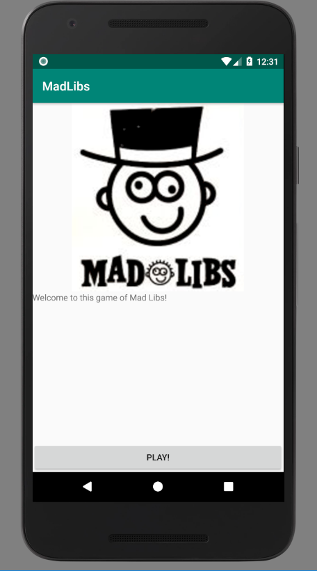
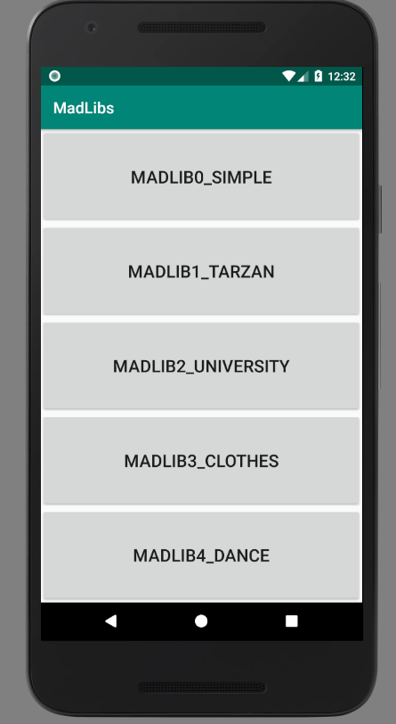
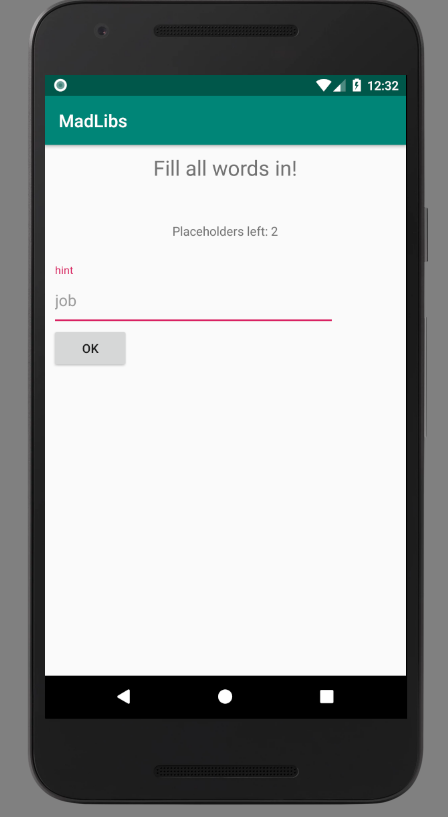
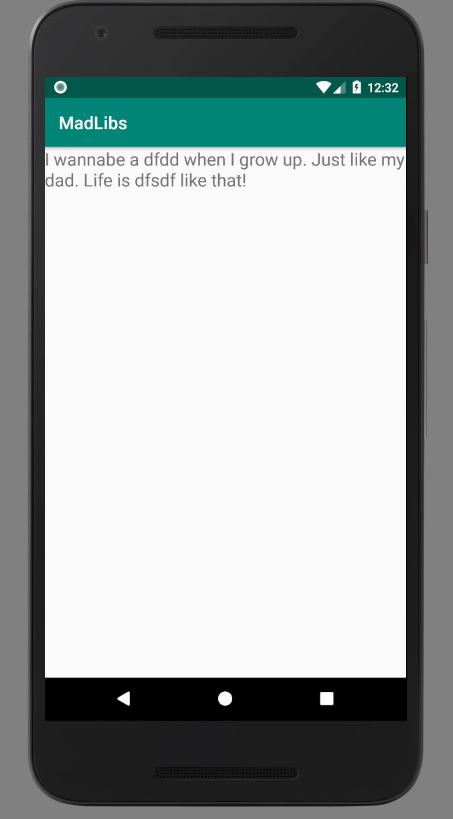

# MadLibs

Sjoerd Terpstra, 11251980
Minor programmeren, App Studio
21-11-2018

This app implements a game called MadLibs. In this game you have to fill in words to complete a story. 
You can only see this story after you filled in the words.

## Screenshots

